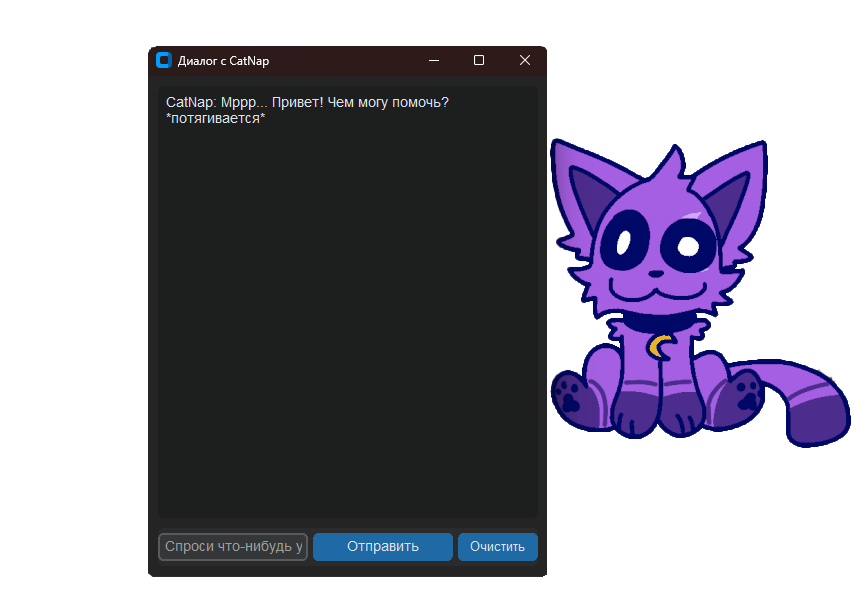

# CatNap Desktop Assistant 😺💤 V1.6.2

Ваш милый, немного сонный, но очень продвинутый настольный ассистент в виде анимированного кота CatNap!



## 🌟 Описание

CatNap - это ваш личный анимированный фиолетовый кот-помощник, который поселится на вашем рабочем столе. Он будет не только украшать ваш рабочий стол своим присутствием, но и помогать с различными задачами, становясь всё умнее и интерактивнее!

**Основные возможности CatNap:**
-   ✨ **Анимированный спрайт:** CatNap теперь оживает благодаря GIF-анимации!
-   🖱️ **Интерактивные зоны:** Кликайте (СКМ) по разным частям тела CatNap (носик, ушки, лапки, кулон, хвостик) и получайте забавные реакции!
-   💖 **"Поглаживание":** Погладьте CatNap средней кнопкой мыши, и он замурлычет от удовольствия!
-   📝 **Запись в Блокнот с помощью ИИ:** Попросите CatNap написать текст на заданную тему, и он сгенерирует его с помощью Gemini, а затем попытается вставить в открытый Блокнот!
-   🗣️ **Общаться и отвечать на вопросы:** С учетом его текущего настроения (которое может меняться!).
-   🚀 **Запускать программы:** Легко откроет Блокнот, Калькулятор, Paint или ваш браузер.
-   🔍 **Искать информацию в интернете:** Просто попросите, и CatNap найдет все, что нужно.
-   🖼️ **"Видеть" ваш экран:** Может сделать скриншот и рассказать, что на нем привлекло его кошачье внимание.
-   👤 **Учитывать ваши предпочтения:** Запомнит ваше имя, хобби и темы, которые вам не нравятся, чтобы общение было еще приятнее.

## ⚙️ Требования

-   Python 3.8 или выше
-   Windows (для корректной работы с прозрачностью и автоматизацией Блокнота с `pyautogui`)
-   API ключ для Google Gemini. Получить его можно на [AI Studio Google](https://aistudio.google.com/app/apikey).

    >> ⚠️ **Важное предупреждение для пользователей из РФ и некоторых других регионов:**
    >> На момент написания этого README, могут возникать сложности с доступом к API Google Gemini. Для полноценной работы функций, использующих Gemini, может потребоваться VPN. Без доступа к API Gemini функционал CatNap будет ограничен.

## 🚀 Установка и Запуск

Перед началом убедитесь, что у вас установлен Git.

1.  **Склонируйте репозиторий:**
    ```bash
    git clone https://github.com/VladGamePlay/catnap-desktop-assistant.git
    cd catnap-desktop-assistant
    ```

2.  **(Рекомендуется) Создайте и активируйте виртуальное окружение:**
    ```bash
    python -m venv venv
    ```
    Активация:
    -   Windows: `.\venv\Scripts\activate`
    -   macOS/Linux: `source venv/bin/activate` (Примечание: полная функциональность `pyautogui` лучше всего работает на Windows)

3.  **Установите необходимые библиотеки:**
    ```bash
    pip install -r requirements.txt
    ```

4.  **Настройте API ключ для Gemini:**
    -   Скопируйте файл `.env.example` и переименуйте копию в `.env`.
    -   Откройте файл `.env` и вставьте свой API ключ Gemini:
        ```dotenv
        GEMINI_API_KEY=ВАШ_РЕАЛЬНЫЙ_API_КЛЮЧ
        ```

5.  **Запустите приложение:**
    Убедитесь, что ваше виртуальное окружение активировано.
    ```bash
    python main.py
    ```

## 🔄 Обновление приложения

1. **Получение обновлений:**
   ```bash
   git pull origin main
   ```

2. **Обновление зависимостей:**
   ```bash
   pip install -r requirements.txt --upgrade
   ```

## ⚠️ Возможные проблемы и их решение

1. **Ошибка "ModuleNotFoundError":**
   - Убедитесь, что виртуальное окружение активировано
   - Проверьте, что все зависимости установлены:
     ```bash
     pip install -r requirements.txt
     ```

2. **Ошибка с API ключом:**
   - Проверьте наличие файла `.env`
   - Убедитесь, что ключ введен правильно
   - Проверьте подключение к интернету
   - Если используете VPN, убедитесь, что он включен

3. **Проблемы с отображением:**
   - Убедитесь, что установлены все системные шрифты
   - Проверьте настройки масштабирования Windows
   - Попробуйте перезапустить приложение

4. **Проблемы с Блокнотом:**
   - Убедитесь, что у вас есть права администратора
   - Проверьте, не блокирует ли антивирус работу с Блокнотом
   - Попробуйте запустить Блокнот вручную перед использованием функции

## 🛠️ Используемые технологии

-   **Python:** Основа всего.
-   **CustomTkinter:** Для создания графического интерфейса.
-   **Google Gemini API:** Мозг CatNap, отвечающий за общение, понимание и генерацию текста.
-   **Pillow (PIL Fork):** Для работы с изображениями и GIF-анимацией.
-   **mss:** Для создания кроссплатформенных скриншотов.
-   **python-dotenv:** Для удобной загрузки переменных окружения.
-   **pyautogui:** Для автоматизации GUI (взаимодействие с Блокнотом).
-   **pyperclip:** Для работы с буфером обмена.

## 📖 Как пользоваться CatNap

-   **Двойной клик ЛКМ по CatNap:** Открыть/Скрыть окно чата.
-   **Зажать ЛКМ и перетащить:** Перемещение CatNap по экрану.
-   **Клик ПКМ по CatNap:** Открыть контекстное меню с командами:
    -   Различные "мыслительные" команды для CatNap.
    -   "Оглянись-ка..." (анализ скриншота).
    -   "Настройки":
        -   Включить/Выключить смену настроений ("Живой КэтНэп").
        -   "Мои предпочтения..." (для персонализации CatNap).
    -   "О программе" (информация о программе).
    -   "Выход".
-   **Клик СКМ (средняя кнопка мыши) по интерактивным зонам спрайта:** Вызывает уникальные реакции (нос, уши, лапы, кулон, хвост).
-   **"Поглаживание" СКМ:** Проведите несколько раз средней кнопкой мыши по CatNap, чтобы он замурлыкал.
-   **Команды в чате:**
    -   `"открой [блокнот/калькулятор/paint/браузер]"`
    -   `"найди [твой запрос]"`
    -   `"запиши в блокнот [твоя тема]"` (CatNap сгенерирует текст и попытается вставить в Блокнот)

## 🗺️ Планы на будущее (Возможные идеи)

-   Больше анимаций и реакций.
-   Звуковые эффекты (мурлыканье, мяуканье).
-   Мини-игры или напоминания.
-   ...и все, что еще придумаем!

## 🤝 Автор и Участие

-   **Идея и основная разработка:** VladGamePlay
-   **Консультации и помощь в разработке:** Gemini AI

Буду рад вашим идеям, предложениям, сообщениям об ошибках (issues) и участию в развитии проекта (pull requests)!

---

*P.S. CatNap очень ценит внимание и общение!*